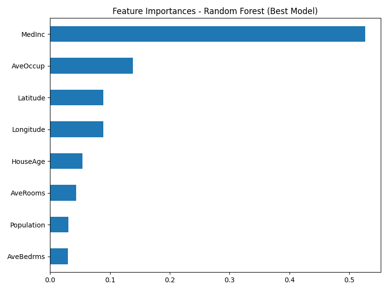

# Predicción de precios de viviendas en California 🏠

## 📌 Descripción
Este proyecto predice el valor medio de viviendas en distintas zonas de California utilizando el dataset **California Housing** incluido en `scikit-learn`.  
El objetivo es aplicar un flujo completo de *Machine Learning*:
1. **EDA** (análisis exploratorio de datos).
2. **Modelo baseline** (Regresión Lineal).
3. **Modelo avanzado** (Random Forest).
4. **Optimización** (Random Forest + GridSearchCV).

---

## 📊 Dataset
- **Fuente**: [`fetch_california_housing`](https://scikit-learn.org/stable/datasets/real_world.html#california-housing-dataset)
- **Filas**: 20640
- **Columnas**: 8 columnas (características) + 1 target (`MedHouseVal`)
- **Unidades**:
  - `MedInc`: Media de los ingresos en decenas de miles USD.
  - `HouseAge`: años.
  - `AveRooms`, `AveBedrms`: medias por vivienda de habitaciones y dormitorios.
  - `Population`: personas.
  - `AveOccup`: personas por hogar.
  - `Latitude`, `Longitude`: grados.
  - `MedHouseVal` (target): centenas de miles USD.

---

## 🔄 Flujo de trabajo
1. **EDA** → exploración de datos, correlaciones, hipótesis.
2. **Baseline** → Regresión Lineal para establecer referencia.
3. **Modelo avanzado** → Random Forest para capturar relaciones no lineales.
4. **Optimización** → GridSearchCV para encontrar la mejor combinación de hiperparámetros (los parámetros editables antes del entrenamiento del modelo).
5. **Evaluación** → comparación de métricas y análisis de importancia de variables.

---

## 📈 Resultados

| Modelo                          | RMSE  | MAE   | R²    |
|---------------------------------|-------|-------|-------|
| **Regresión Lineal (baseline)** | 0.746 | 0.533 | 0.576 |
| **Random Forest**               | 0.503 | 0.327 | 0.807 |
| **Random Forest+GridSearchCV**  | 0.503 | 0.326 | 0.807 |

> **Interpretación**:  
> - El Random Forest reduce el error medio en ~22 000 USD respecto al baseline, una gran mejora.  
> - El tuning confirmó que el modelo inicial ya estaba casi optimizado.  
> - La variable más influyente es `MedInc`, seguida de `AveOccup` y la ubicación (`Latitude`, `Longitude`).

---

## 📊 Importancia de variables

---

## 🛠 Tecnologías usadas
- Python 3.12
- pandas, numpy, matplotlib, seaborn
- scikit-learn
- Jupyter Notebook

---

## 📚 Qué aprendí
- Cómo realizar un EDA estructurado.
- Por qué es importante un modelo baseline antes de mejoras.
- Cómo funcionan y se interpretan Random Forests.
- Uso de `GridSearchCV` para optimización de hiperparámetros.
- Interpretación de métricas: RMSE, MAE, R².

---

## 🚀 Próximos pasos
- Probar modelos de *Gradient Boosting* (`HistGradientBoostingRegressor`, XGBoost).
- Añadir validación cruzada estratificada.
- Implementar pipeline con `ColumnTransformer` para datos mixtos.

---

## 📜 Licencia
Este proyecto está bajo la licencia MIT - ver el archivo [LICENSE](LICENSE) para más detalles.
